# Create a Microsoft Foundry Hosted Agent by Prompting Claude Code

This is a walkthrough for a developer who wants to **build a Foundry hosted agent by
prompting Claude Code** — not by hand-writing `azd` commands. You set up the environment
once, then you literally type *"I want to create a Foundry Hosted Agent"* and the
Microsoft Foundry Skill drives the scaffold → provision → deploy for you.

Optionally, you can then **publish the agent to Teams & Microsoft 365 Copilot**.

```
PHASE 1 (once)              PHASE 2 (prompt)           PHASE 3            PHASE 4 (optional)
Set up environment    -->   Prompt Claude Code   -->   Verify in    -->  Publish to Teams
(RBAC, Dev Pack,            "create a hosted           Foundry           & M365 Copilot
 Foundry Skill,             agent that…"               portal            (admin approval)
 deploy a model)
```

> **Docker?** **Not required.** Foundry builds the agent's container image in the cloud
> (remote build). See [Docker](#docker--not-required).

---

## Concepts first: control plane vs. data plane

Understanding these two planes explains *why* the RBAC assignments below are needed.

**Control plane** — the Azure resource hierarchy you manage (create/deploy models, projects):

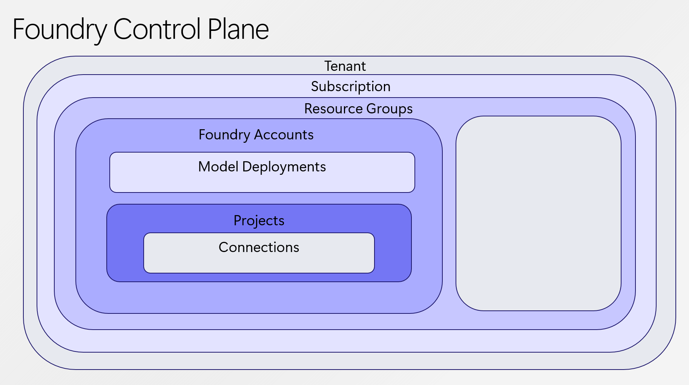

**Data plane** — what lives *inside* a Foundry project and runs at agent runtime (agents,
agent versions, endpoints, toolboxes, memory, evaluations):

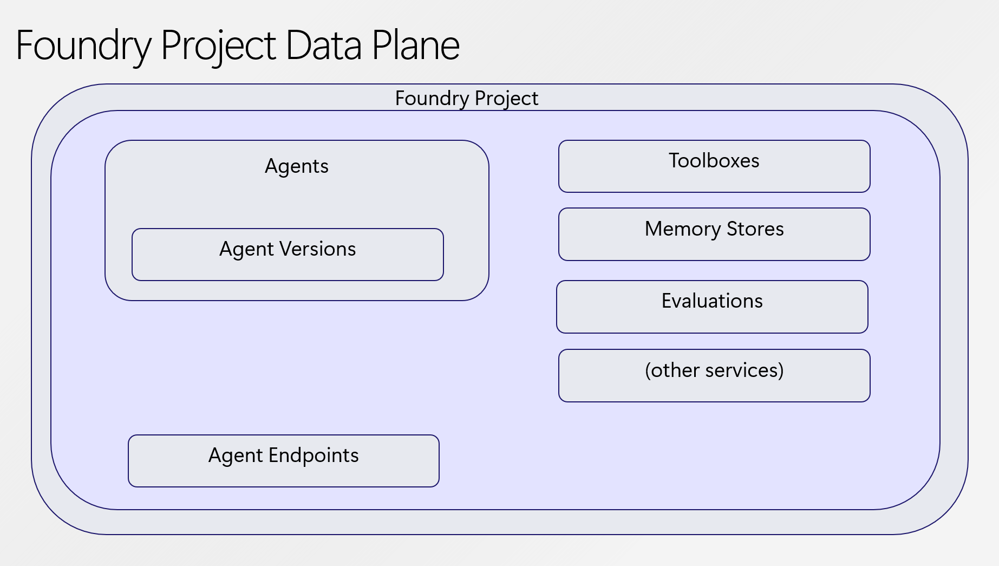

Azure **Owner** is a *control-plane* role. It lets you create resources and assign roles,
but it does **not** by itself grant the *data-plane* permissions that building and running
agents require — which is exactly why the Foundry roles below are still needed.

---

# PHASE 1 — One-time environment setup

## 1.1 Assign the right roles (RBAC)

Two identities need Foundry data-plane access:

| Identity | Role | Why |
|----------|------|-----|
| **The developer** | **Foundry User** (or **Foundry Owner** if they'll also administer/assign roles) | Build & develop in a project (data actions). Foundry User is the least-privilege "best for developers" role. |
| **The project's managed identity** | **Foundry User** | The deployed agent runs **as this identity** and needs data-plane access to call models, tools, and project data at runtime. |
| **Whoever deploys the model** | **Foundry Account Owner** or **Foundry Owner** | The agent needs a **model deployment** (e.g. `gpt-5.4`) to run against. Creating that deployment is a privileged action — **Foundry User alone cannot deploy models.** See [1.4](#14-deploy-a-model-the-agent-will-use). |

> ⚠️ **Model deployment permission.** A hosted agent is useless without a model to call. If the developer is also the one deploying the model, make sure they hold **Foundry Account Owner** or **Foundry Owner** — the least-privilege **Foundry User** role does **not** grant model-deployment rights.

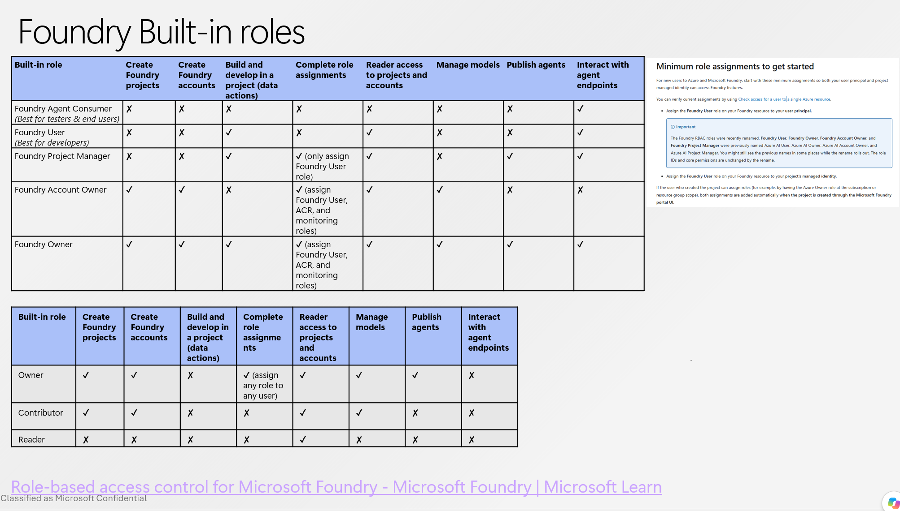

**Notes**
- If the project is created through the **Foundry portal UI** by someone who can assign
  roles (Azure Owner qualifies), **both** Foundry User assignments are added
  **automatically**. Assign manually only for CLI/IaC-created projects.
- `Foundry User` was formerly `Azure AI User` (role IDs unchanged during the rename).
- Use **Foundry Agent Consumer** for principals that only *call* the agent (testers/end users).

📖 [RBAC for Microsoft Foundry](https://learn.microsoft.com/azure/foundry/concepts/rbac-foundry)

## 1.2 Install the Foundry Dev Pack

The Foundry Dev Pack is the one-command way to install the developer tools — but the
**command differs by dev box (OS)**. Pick the one for your machine:

| Dev box | Install command |
|---------|-----------------|
| **Windows** (what this walkthrough uses) | `winget install Microsoft.FoundryDevPack` |
| **macOS** | `brew install --cask microsoft/foundry/devpack && foundry-devpack install` |
| **Linux** | `curl -fsSL https://aka.ms/foundry-devpack-install.sh \| bash` |

Since this is a **Windows** machine, run the winget command (it pulls in Azure CLI + Azure
Developer CLI as dependencies):

```powershell
winget install Microsoft.FoundryDevPack
```

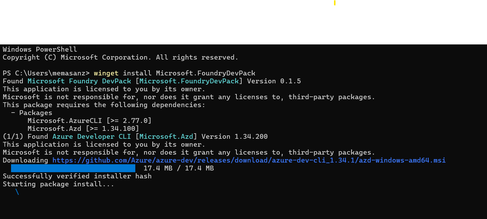

**What it installs** (per the installer's own output):

- **Foundry command-line tools** — Azure CLI, Azure Developer CLI (`azd`), and the Foundry
  extension for azd (`azd ai`).
- **Microsoft Foundry Skill** — dropped at `~/.agents/skills/` **and** `~/.claude/skills/`
  (if Claude Code is available). This is what teaches your coding agent the Foundry workflow.
- **Microsoft Foundry Toolkit for VS Code** (if applicable).
- **Foundry Canvas (preview)** for the GitHub Copilot app (if applicable).

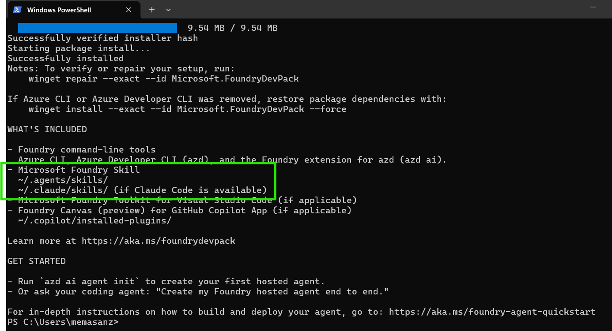

> **Install separately** (not in the Dev Pack): a language runtime (Python 3.13/3.14 or
> .NET 10) and, on Windows, Git Bash or WSL2.

**Get started** (from the installer):
- Run `azd ai agent init` to create your first hosted agent, **or**
- Just ask your coding agent: *"Create my Foundry hosted agent end to end."*

## 1.3 Make the Foundry Skill available to Claude

- **Claude Code (CLI):** the Dev Pack already places the skill at `~/.claude/skills/` — nothing to do.
- **Claude desktop app:** add the skill manually — **Settings → Skills → Add**, then upload
  `SKILL.md` from `~/.agents/skills/microsoft-foundry/SKILL.md`.

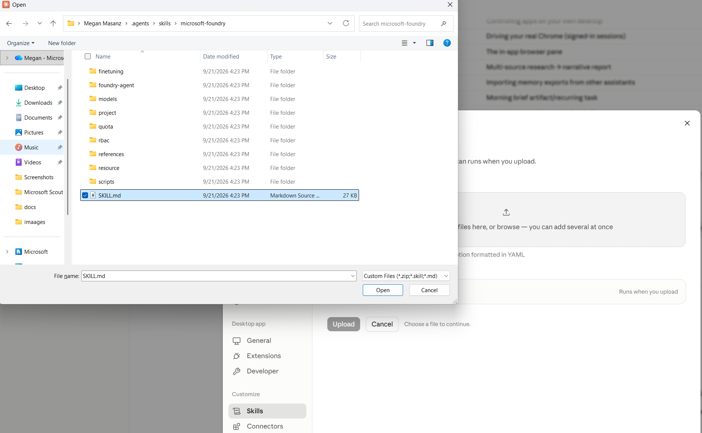

A security scan runs and shows a preview of the `microsoft-foundry` skill; click **Upload**:

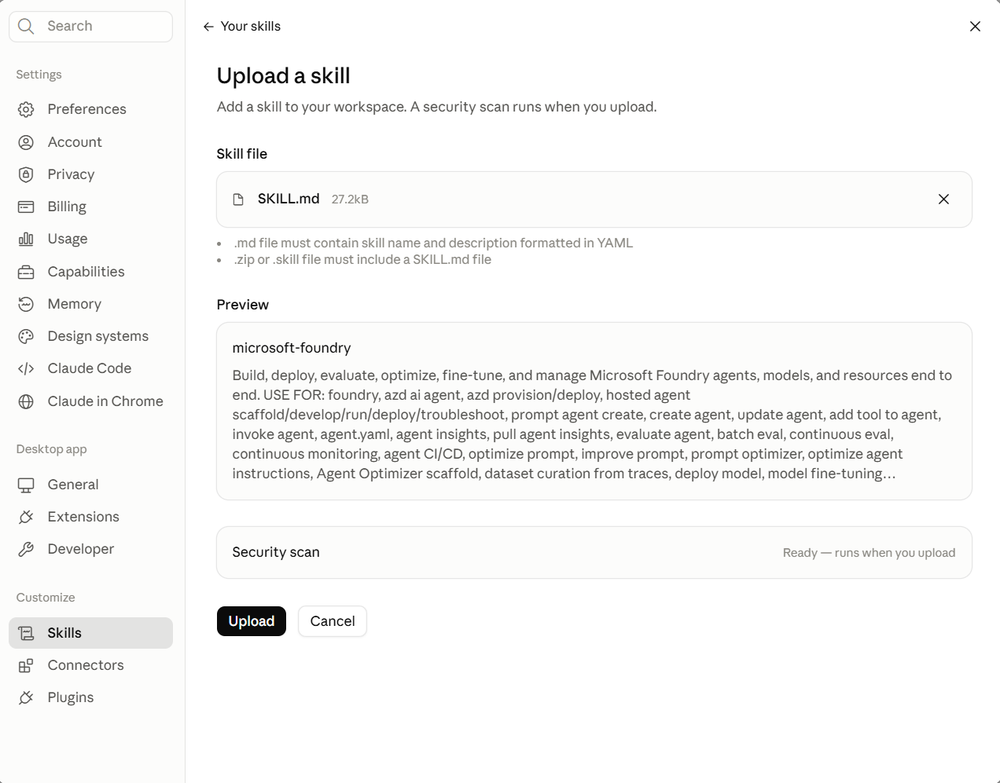

The `microsoft-foundry` skill now appears under **Created by you**:

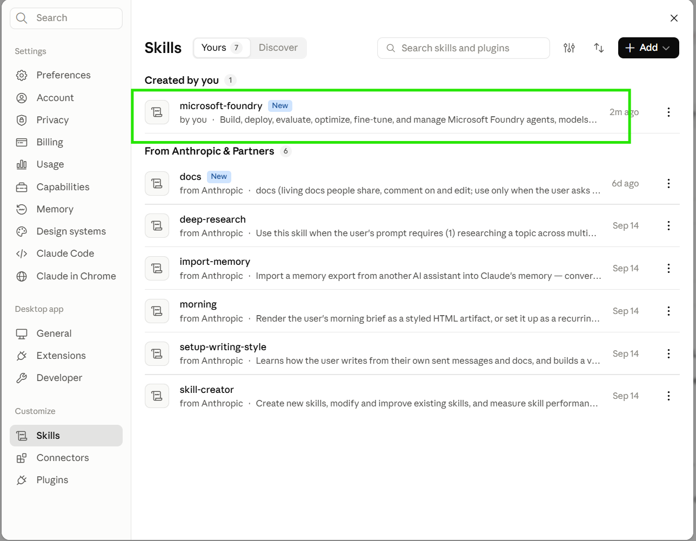

## 1.4 Deploy a model the agent will use

A hosted agent runs *against a model deployment* — so at least one model (e.g. `gpt-5.4`)
must be deployed in your Foundry project **before** you prompt Claude to build the agent.
In Phase 2 you'll hand Claude that deployment name.

> ⚠️ **Permission required.** Deploying a model is a privileged action. You need
> **Foundry Account Owner** or **Foundry Owner** on the Foundry resource — the least-privilege
> **Foundry User** role can build agents but **cannot deploy models**. If you don't have it,
> ask whoever holds Foundry Owner / Account Owner to either deploy the model for you or grant
> the role.

You have two paths:

- **Let Claude do it.** With the Foundry Skill installed, just ask:
  *"Deploy a `gpt-5.4` model to my Foundry project."* The skill checks quota/capacity,
  confirms the target project, and creates the deployment (provided your identity has the
  Owner/Account Owner role above).
- **Deploy it yourself** in the **Foundry portal → Deployments → Deploy model**, or via
  `az cognitiveservices account deployment create`. Pick a region/SKU with available quota.

> 💡 **azd-managed projects:** if your project was scaffolded with `azd ai agent init`,
> prefer declaring the deployment in `azure.yaml` under `services.ai-project.deployments[]`
> so `azd provision` creates it — rather than deploying out-of-band.

**Note the deployment name** — you'll paste it into Phase 2.

✅ **Environment ready.** From here, building agents is just prompting.

---

# PHASE 2 — Prompt Claude Code to create the agent

Start Claude Code and type your intent:

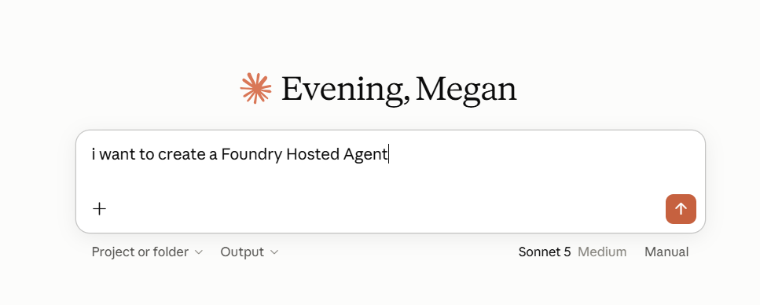

The Foundry Skill kicks in and **asks a few clarifying questions** — how to define the agent,
whether you already have a project/endpoint, which model deployment to use, and how auth
should work. Answer inline (e.g., paste your **project endpoint**, give the **model deployment
name** you created in [1.4](#14-deploy-a-model-the-agent-will-use), like `gpt-5.4`):

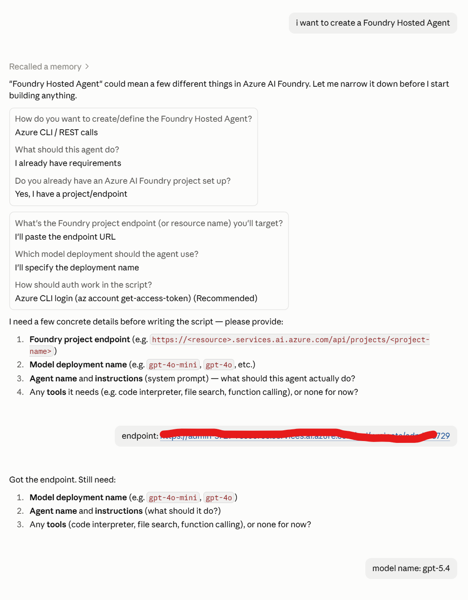

Give it the **agent name** and any **tools** (here: name `claude-code-made-me`, tool =
Microsoft Learn MCP). Claude verifies the exact Foundry REST shape, confirms you're logged
into `az`, then **creates and tests** the agent:

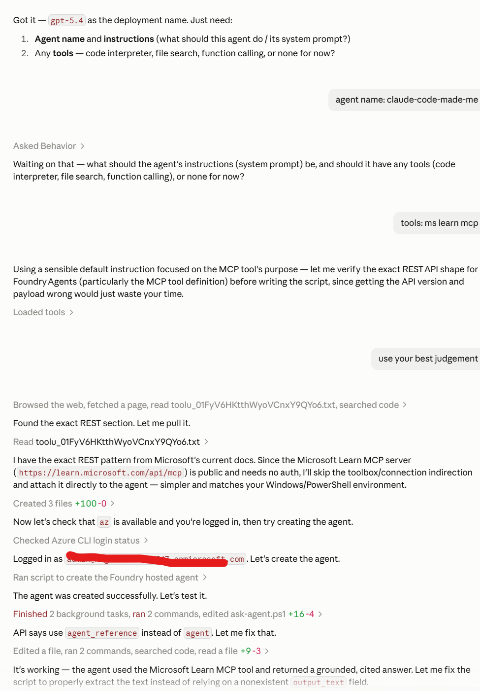

It reads `azure.yaml`, **provisions** against your existing project, and **deploys** the
hosted agent (uploads code; Foundry builds and runs it remotely). Note the important
behavior it handles automatically: **an agent's kind (prompt vs. hosted) is fixed at
creation**, so it deletes any prior prompt-agent version and redeploys under the same name
as a **hosted** agent:

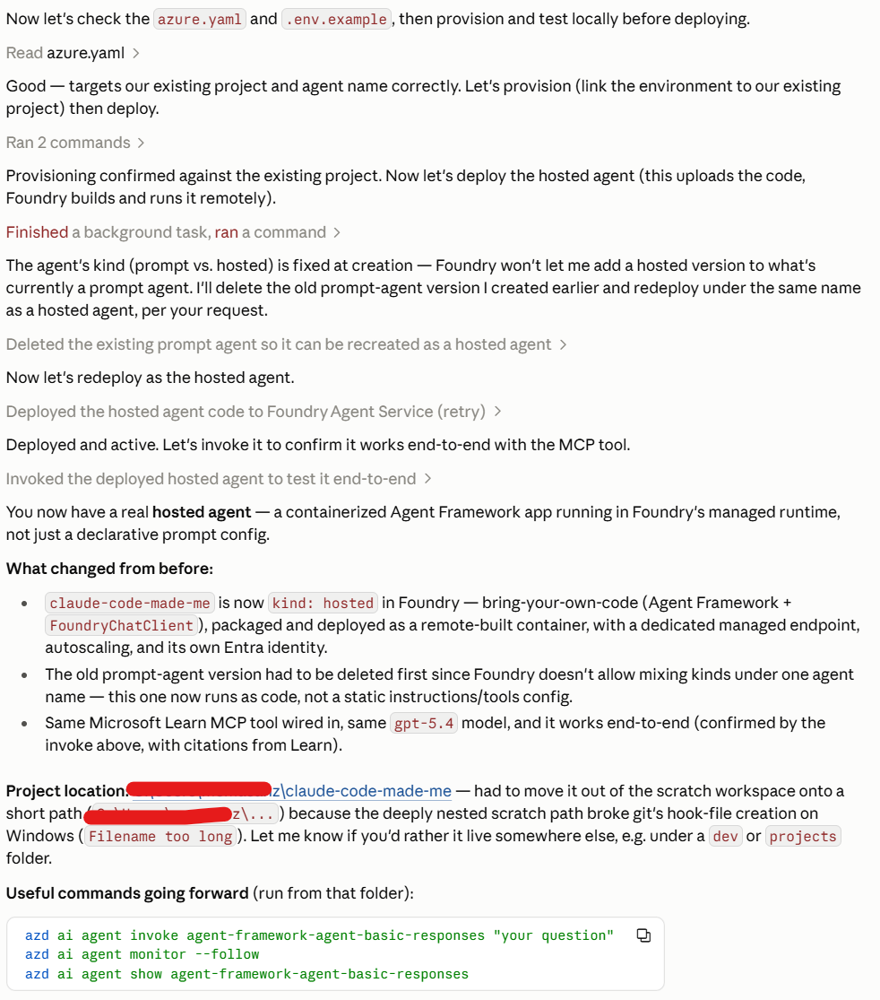

**What you end up with:** a real **hosted** agent (`kind: hosted`) — a containerized Agent
Framework app (`FoundryChatClient`) running in Foundry's managed runtime, with a dedicated
managed endpoint, autoscaling, and its own Entra identity.

> **Windows tip (seen in the demo):** deeply nested scratch paths can break git hook-file
> creation (`Filename too long`). If that happens, let Claude move the project to a short
> path (e.g. under `dev\` or `projects\`).

**Useful commands going forward:**
```bash
azd ai agent invoke <agent-name> "your question"
azd ai agent monitor --follow
azd ai agent show <agent-name>
```

---

# PHASE 3 — Verify in the Foundry portal

Open the Foundry portal → **Build → Agents**. The agent shows **Status: Running**,
**Type: Hosted**, **Version 1**:

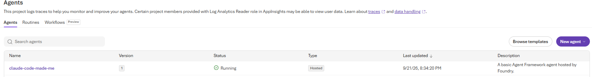

At this point the agent works end-to-end but is **Not shared** (visible in Agent 365 / the
org registry):

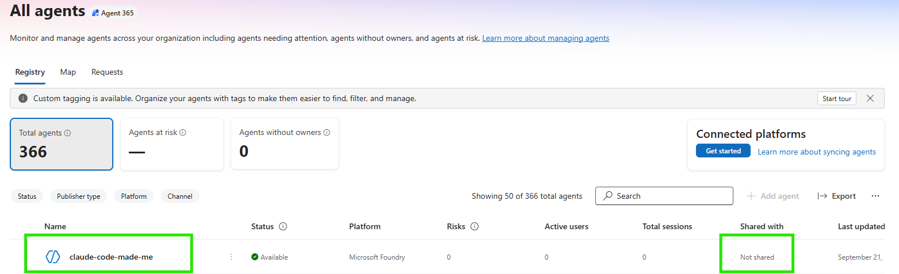

---

# PHASE 4 — (Optional) Publish to Teams & Microsoft 365 Copilot

## 4.1 Publish from Foundry
On the agent's page, open the **Publish** dropdown → **Teams & Microsoft 365 Copilot**:

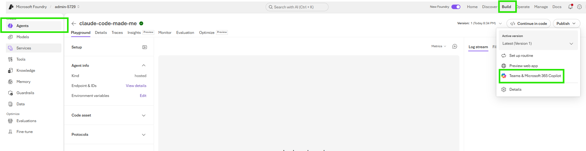

Choose **who can use it** — *Just you* (immediate) or *People in your organization* (requires
M365 admin approval) — then **Publish**:

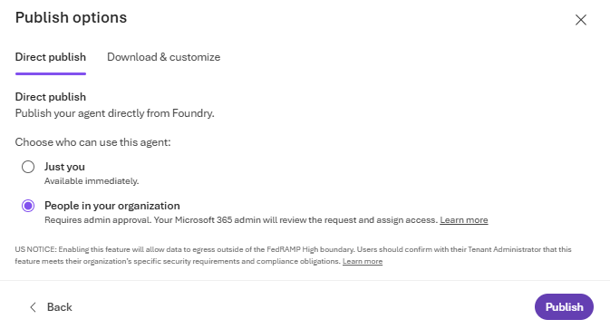

You'll get confirmation that an **admin must approve** the request in the Microsoft 365 admin
center under **Requests**:

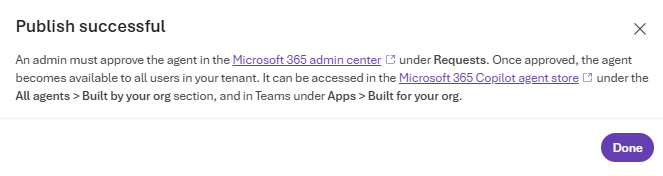

## 4.2 Admin approves (Microsoft 365 admin center)
Give it **~5 minutes** for the request to appear:

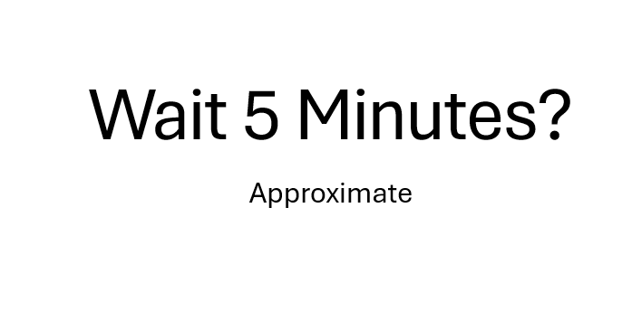

In the M365 admin center → **Agents → All agents → Requests**:

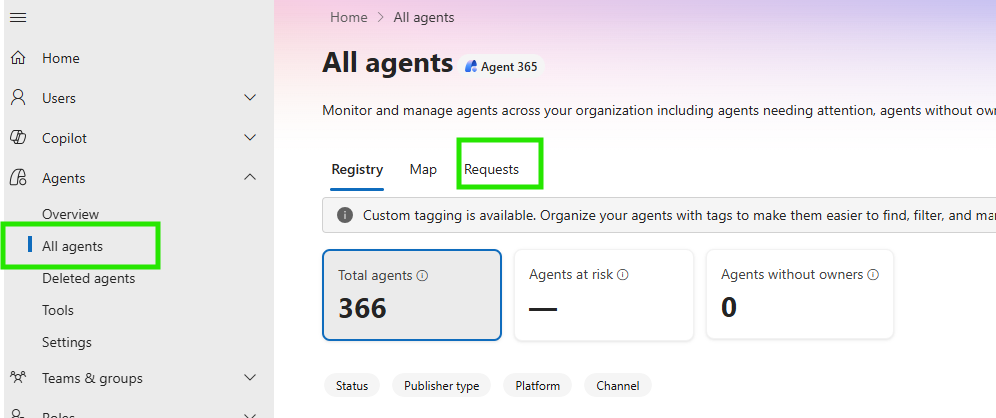

Find the pending agent → **Publish to store** (or Reject):

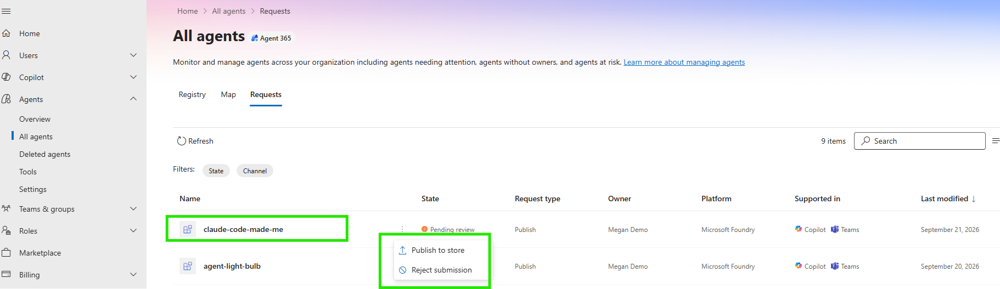

Complete the **Publish new agent** wizard — select users/groups, apply template, accept
permissions, review & finish:

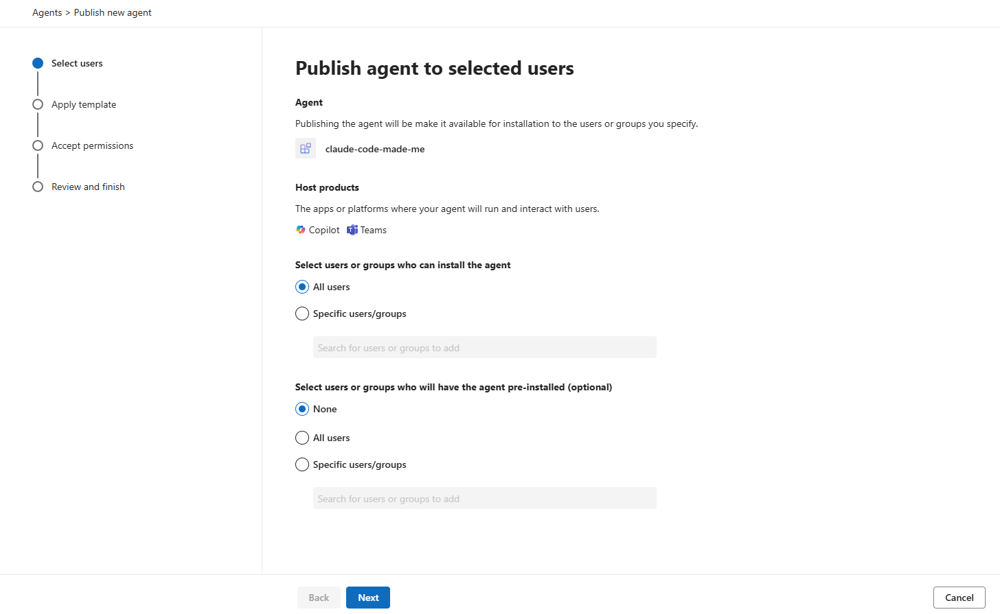

## 4.3 Users add and use the agent
End users **Add** the agent from Teams/Copilot (Apps → *Built for your org*):

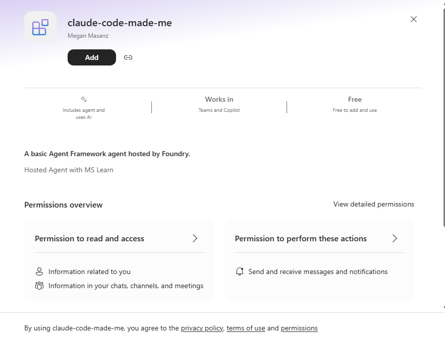

…and use it right inside Copilot/Teams:

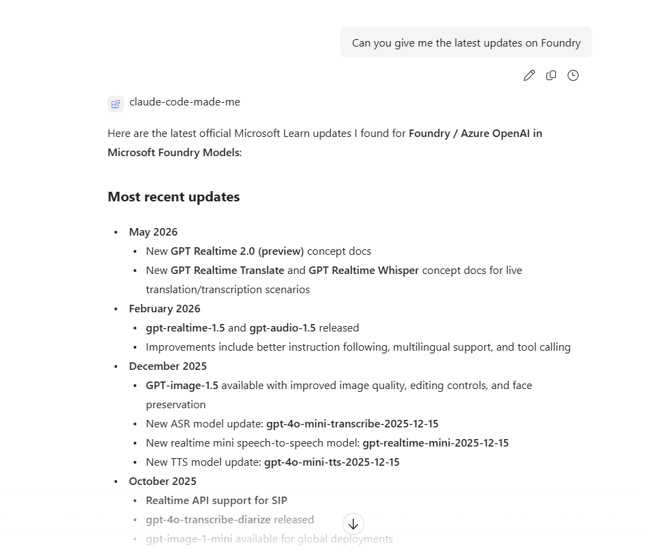

---

## Docker — not required

The hosted-agent deploy uses a **remote build**: your code is uploaded and **Foundry builds
the container image in the cloud** and runs it in its managed runtime. No Docker daemon on
the developer's machine.

| Deploy path | Docker on desktop? |
|-------------|--------------------|
| Code deploy / **remote** container build (default) | **No** — Foundry/ACR builds the image server-side |
| **Local** container build | **Yes** — only if you explicitly build the image locally |

Only install Docker if you deliberately need a local container build.

---

## Quick checklist

**Phase 1 — setup (once)**
- [ ] Developer has **Foundry User** (or **Foundry Owner**) on the Foundry resource
- [ ] Project's **managed identity** has **Foundry User**
- [ ] A **model is deployed** in the project (e.g. `gpt-5.4`) — requires **Foundry Account Owner** / **Foundry Owner**
- [ ] Install the **Foundry Dev Pack** for your dev box — Windows: `winget install Microsoft.FoundryDevPack`; macOS: `brew install --cask microsoft/foundry/devpack && foundry-devpack install`; Linux: `curl -fsSL https://aka.ms/foundry-devpack-install.sh | bash` (installs `az`, `azd`, Foundry `azd` ext, **Foundry Skill**)
- [ ] Language runtime installed (Python 3.13/3.14 or .NET 10); Windows: Git Bash/WSL2
- [ ] Foundry Skill available to Claude (auto for Claude Code CLI; upload `SKILL.md` for the desktop app)
- [ ] `az login` completed

**Phase 2–3 — build**
- [ ] Prompt Claude Code: *"I want to create a Foundry Hosted Agent"*
- [ ] Provide endpoint, model deployment name, agent name, tools
- [ ] Agent shows **Running / Hosted** in the Foundry portal

**Phase 4 — publish (optional)**
- [ ] Foundry → Publish → Teams & M365 Copilot
- [ ] M365 admin approves under **Agents → Requests**
- [ ] Users **Add** it in Teams/Copilot

### Key links
- RBAC: https://learn.microsoft.com/azure/foundry/concepts/rbac-foundry
- Deploy a model: https://learn.microsoft.com/azure/ai-foundry/how-to/deploy-models-openai
- Dev Pack: https://aka.ms/foundrydevpack
- Prepare your dev environment (per-OS install): https://learn.microsoft.com/azure/foundry/how-to/develop/install-cli-sdk
- Hosted agent quickstart: https://aka.ms/foundry-agent-quickstart
- Configure Claude Code for Foundry: https://learn.microsoft.com/azure/foundry/foundry-models/how-to/configure-claude-code
- Hosted agents concept: https://learn.microsoft.com/azure/ai-foundry/agents/concepts/hosted-agents?view=foundry
